# YouTube Trending Data Pipeline

A cloud-native ETL pipeline that ingests YouTube trending video data across 10 regions, transforms it through a medallion architecture (Bronze → Silver → Gold), enforces data quality gates, and produces analytics-ready aggregations — all orchestrated by AWS Step Functions.

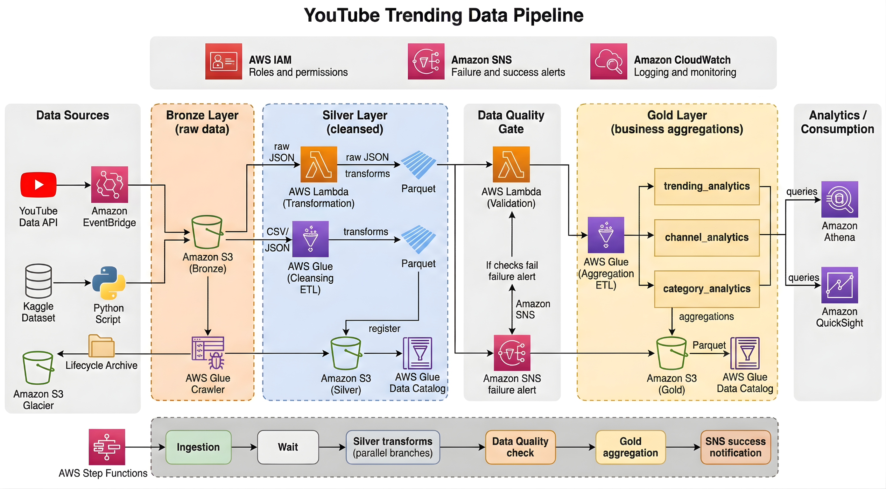

---

## Table of Contents

- [Overview](#overview)
- [Business Problem](#business-problem)
- [Architecture](#architecture)
- [Tech Stack](#tech-stack)
- [Project Structure](#project-structure)
- [Data Flow](#data-flow)
  - [Bronze Layer (Raw Data)](#bronze-layer-raw-data)
  - [Silver Layer (Cleansed Data)](#silver-layer-cleansed-data)
  - [Data Quality Gate](#data-quality-gate)
  - [Gold Layer (Business Aggregations)](#gold-layer-business-aggregations)
- [Gold Layer Output Tables](#gold-layer-output-tables)
- [Prerequisites](#prerequisites)
- [AWS Infrastructure Setup](#aws-infrastructure-setup)
- [Configuration](#configuration)
- [Deployment](#deployment)
- [Running the Pipeline](#running-the-pipeline)
- [Monitoring and Alerting](#monitoring-and-alerting)
- [Supported Regions](#supported-regions)
- [Data Sources](#data-sources)
- [Performance Optimizations](#performance-optimizations)
- [Future Improvements](#future-improvements)
- [Results](#results)

---

## Overview

This project is a production-style end-to-end data engineering pipeline built on AWS. It automates ingestion from the YouTube Data API, stores raw and cleansed datasets, validates data quality, and builds analytics-ready aggregations for business reporting.

Key capabilities:

- Live YouTube Data API v3 ingestion across 10 regions
- Bronze, Silver, and Gold medallion architecture
- AWS Glue PySpark ETL transformations
- Data quality gates via Lambda
- Orchestration with AWS Step Functions
- Analytics-ready output for Athena and BI dashboards

---

## Business Problem

Organizations often rely on manually downloaded datasets for analytics. This creates several challenges:

- Delayed reporting
- Manual intervention
- No monitoring
- Data quality issues
- No scalability

This solution removes the manual download process and builds an automated, monitored data pipeline for trending YouTube video analytics.

---

## Architecture

The pipeline follows a medallion architecture pattern with raw, cleansed, and business-ready data layers.

```
Data Sources          Bronze              Silver            Quality Gate          Gold              Analytics
┌──────────┐     ┌──────────────┐    ┌──────────────┐    ┌────────────┐    ┌──────────────┐    ┌──────────┐
│ YouTube  │     │              │    │              │    │            │    │  trending_   │    │          │
│ API v3   │────>│  Raw JSON    │───>│  Cleansed    │───>│  DQ Lambda │───>│  analytics   │    │  Athena  │
│          │     │  (S3)        │    │  Parquet     │    │  Validates │    │              │    │          │
├──────────┤     │              │    │              │    │  row count │    │  channel_    │    ├──────────┤
│ Kaggle   │     │  Raw CSV     │    │              │    │  nulls     │    │  analytics   │    │  Quick-  │
│ Dataset  │────>│  (S3)        │    │  Parquet     │    │  schema    │    │              │    │  Sight   │
│          │     │              │    │              │    │  freshness │    │  category_   │    │          │
└──────────┘     └──────────────┘    └──────────────┘    └────────────┘    │  analytics   │    └──────────┘
                                                              │           └──────────────┘
                                                         fail │
                                                              ▼
                                                        ┌────────────┐
                                                        │  SNS Alert │
                                                        └────────────┘
```

**Orchestration** is handled by AWS Step Functions, with retry logic, parallel execution, and failure notifications.

---

## Tech Stack

| Component           | Technology                          |
|---------------------|-------------------------------------|
| **Compute**         | AWS Lambda, AWS Glue (PySpark)      |
| **Storage**         | Amazon S3 (Parquet, Snappy)         |
| **Orchestration**   | AWS Step Functions                  |
| **Scheduling**      | Amazon EventBridge                  |
| **Metadata**        | AWS Glue Data Catalog               |
| **Query Engine**    | Amazon Athena                       |
| **Alerting**        | Amazon SNS                          |
| **Monitoring**      | Amazon CloudWatch                   |
| **Security**        | AWS IAM                             |
| **Languages**       | Python 3, PySpark, SQL              |
| **Libraries**       | Pandas, AWS Wrangler, Boto3         |
| **Data Format**     | Parquet (Snappy compression)        |

---

## Project Structure

```
youtube-data-pipeline-aws/
│
├── athena/
│   ├── bronze_analytical_queries.sql
│   └── gold_analytical_queries.sql
│
├── data/
│   ├── CA_category_id.json
│   ├── CAvideos.csv
│   ├── DE_category_id.json
│   ├── DEvideos.csv
│   ├── FR_category_id.json
│   ├── FRvideos.csv
│   ├── GB_category_id.json
│   ├── GBvideos.csv
│   ├── IN_category_id.json
│   ├── INvideos.csv
│   ├── JP_category_id.json
│   ├── JPvideos.csv
│   ├── KR_category_id.json
│   ├── KRvideos.csv
│   ├── MX_category_id.json
│   ├── MXvideos.csv
│   ├── RU_category_id.json
│   ├── RUvideos.csv
│   ├── US_category_id.json
│   └── USvideos.csv
│
├── glue jobs/
│   ├── bronze_to_silver_statistics.py
│   └── silver_to_gold_analytics.py
│
├── iam_roles/
│   ├── yt-data-pipeline-glue-role-dev.jsonc
│   ├── yt-data-pipeline-lambda-role-dev.jsonc
│   └── yt-data-pipeline-stepfunction-role-dev.jsonc
│
├── lambda/
│   ├── data_quality/
│   │   └── lambda_function.py
│   ├── json_to_parquet/
│   │   └── lambda_function.py
│   └── youtube_api_ingestion/
│       └── lambda_function.py
│
├── scripts/
│   ├── aws_copy.sh
│   └── info.txt
│
├── stepfunction/
│   └── pipeline_orchestration.json
│
└── README.md
```

---

## Data Flow

### Bronze Layer (Raw Data)

The ingestion Lambda fetches live trending video data from the YouTube Data API v3 and stores raw payloads in S3.

- **Trending videos** — top trending results across 10 supported regions
- **Category mappings** — YouTube category reference data
- **Historical backfill** — Kaggle CSV files can be loaded into Bronze via `scripts/aws_copy.sh`

Partitioning example:

```
s3://bronze-bucket/youtube/raw_statistics/region=US/date=2026-05-17/hour=12/
```

Snapshot:

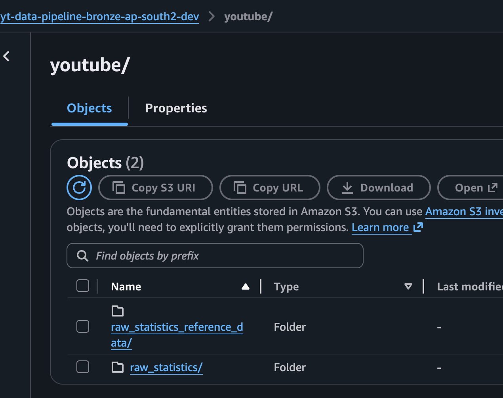

---

### Silver Layer (Cleansed Data)

Two parallel transformations produce cleansed datasets:

1. **Statistics transformation** (`glue jobs/bronze_to_silver_statistics.py`)
   - Normalize YouTube API JSON and Kaggle CSV formats
   - Enforce schema and cast numeric columns
   - Standardize dates and region values
   - Deduplicate trending records
   - Derive metrics: `like_ratio` and `engagement_rate`
   - Output Parquet partitioned by `region`

2. **Reference data transformation** (`lambda/json_to_parquet/lambda_function.py`)
   - Normalize category mappings
   - Deduplicate category records
   - Output Parquet partitioned by `region`

Snapshots:

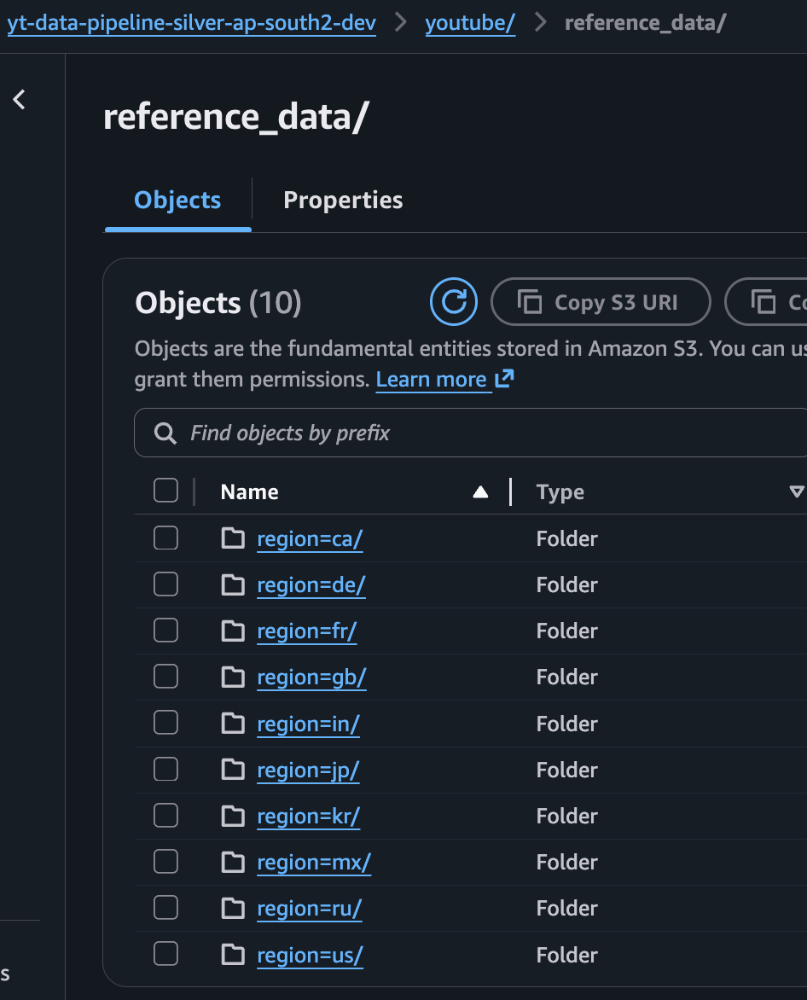

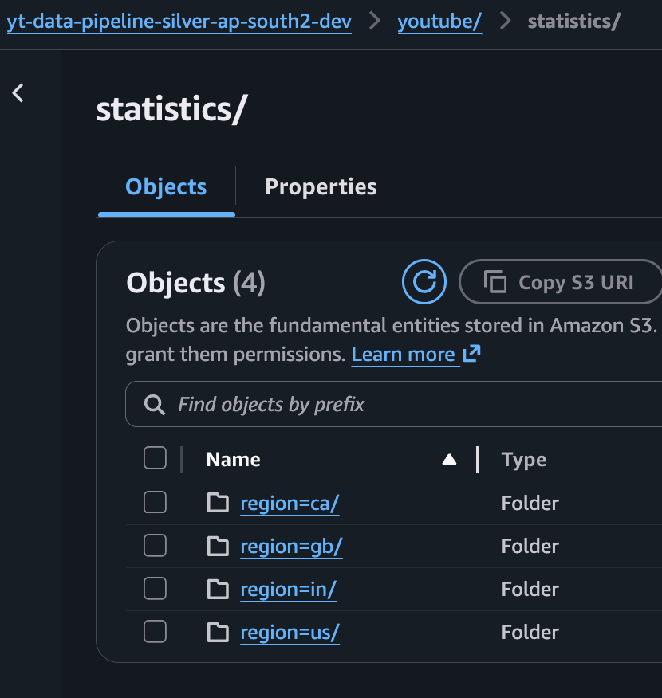

---

### Data Quality Gate

The pipeline validates Silver data before triggering Gold aggregation.

Checks include:

- **Row count** — minimum threshold
- **Schema validation** — required columns must exist
- **Null percentage** — critical columns must be populated
- **Value ranges** — views and engagement sanity checks
- **Freshness** — recent data is required

If validation fails, the pipeline halts and sends an SNS alert instead of generating Gold analytics.

---

### Gold Layer (Business Aggregations)

A Glue job builds analytics-ready tables from cleansed Silver data.

- **Trending analytics** — daily region-level trend metrics
- **Channel analytics** — channel performance, ranking, and trending frequency
- **Category analytics** — category view share and engagement trends

Snapshots:

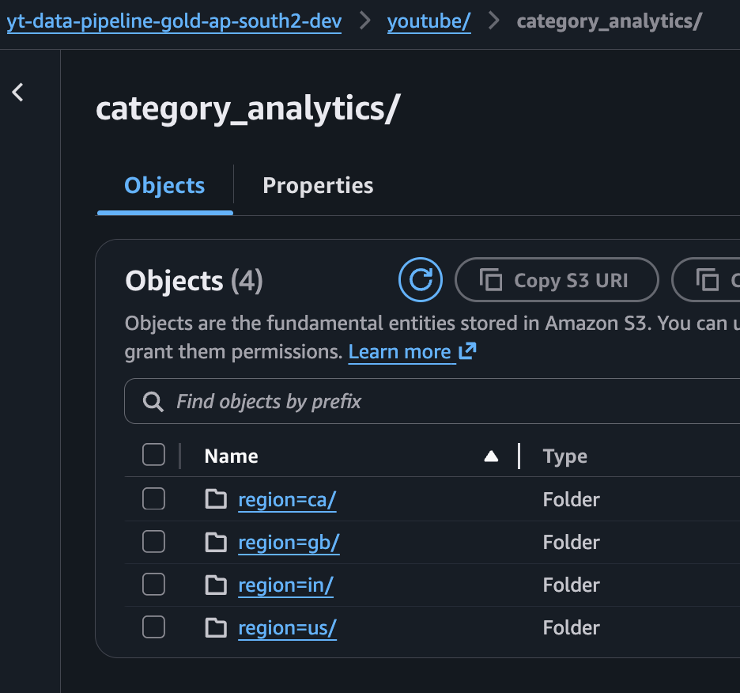

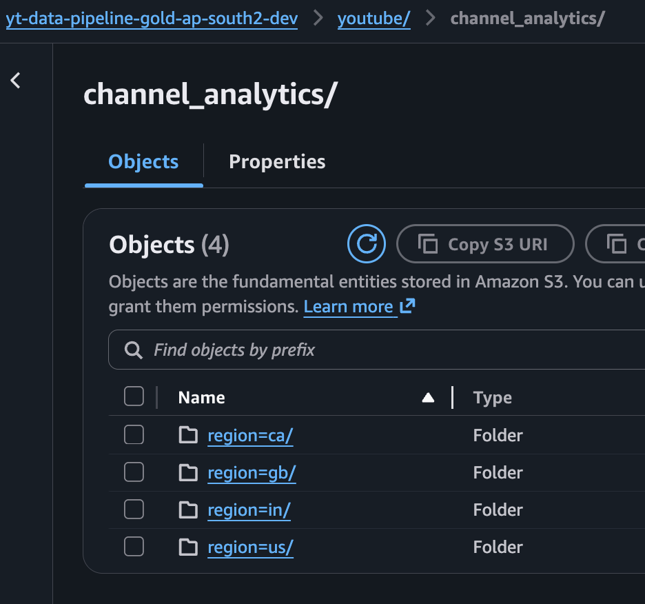

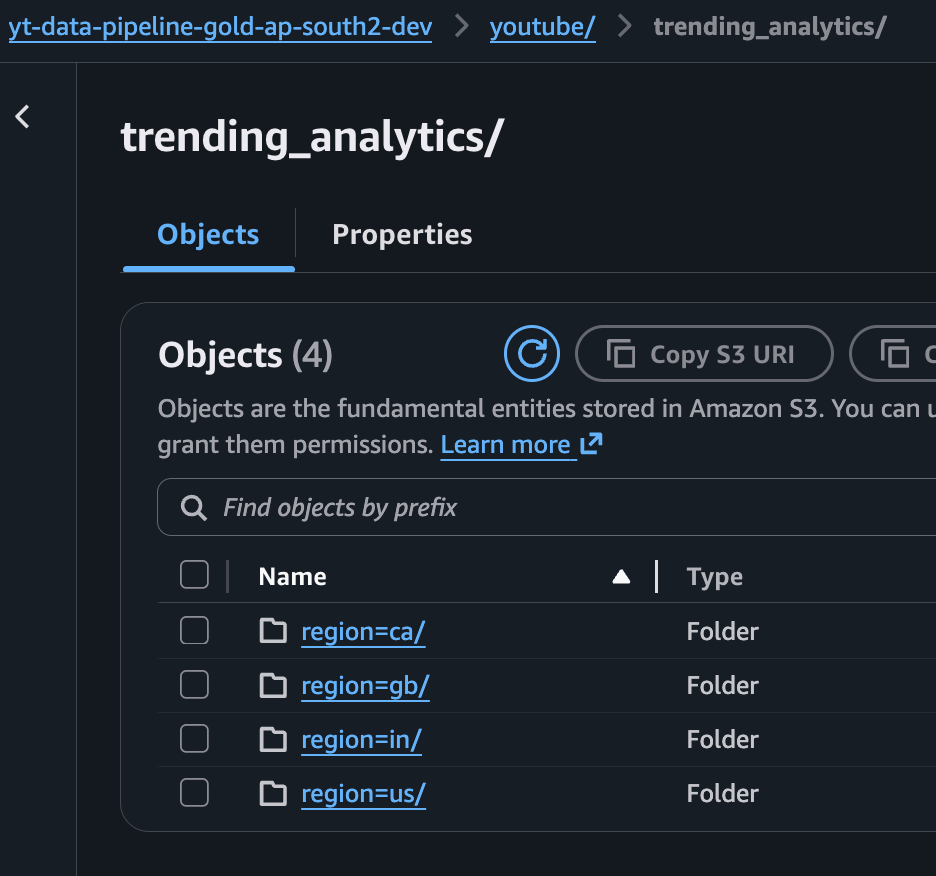

---

## Gold Layer Output Tables

### `trending_analytics`

Daily trending performance by region.

- `region` — country code (US, GB, CA, etc.)
- `trending_date_parsed` — trending snapshot date
- `total_videos` — trending video count
- `total_views` — sum of views
- `total_likes` — sum of likes
- `avg_views_per_video` — average views per video
- `avg_like_ratio` — average like ratio
- `avg_engagement_rate` — average engagement rate
- `unique_channels` — number of distinct channels
- `unique_categories` — number of distinct categories

### `channel_analytics`

Channel-level performance and ranking.

- `channel_title` — YouTube channel name
- `region` — country code
- `total_videos` — videos that trended
- `total_views` — total trending views
- `avg_engagement_rate` — average engagement rate
- `times_trending` — trending frequency
- `rank_in_region` — regional performance rank
- `categories` — categories the channel appears in

### `category_analytics`

Category-level breakdowns with share metrics.

- `category` — video category name
- `region` — country code
- `trending_date_parsed` — trending snapshot date
- `video_count` — number of videos in category
- `total_views` — total views for the category
- `avg_engagement_rate` — average engagement rate
- `view_share_pct` — percentage share of views

All Gold tables are stored as Parquet (Snappy compressed), partitioned by `region`, and registered in the Glue Data Catalog for Athena analysis.

---

## Prerequisites

- AWS account with permissions for Lambda, Glue, S3, Step Functions, SNS, IAM, Athena, EventBridge, and CloudWatch
- YouTube Data API v3 key
- AWS CLI configured with valid credentials
- Python 3.9+

---

## AWS Infrastructure Setup

Create core S3 buckets:

```bash
aws s3 mb s3://yt-data-pipeline-bronze-<region>-<env>
aws s3 mb s3://yt-data-pipeline-silver-<region>-<env>
aws s3 mb s3://yt-data-pipeline-gold-<region>-<env>
aws s3 mb s3://yt-data-pipeline-script-<region>-<env>
```

Create Glue databases:

```bash
aws glue create-database --database-input '{"Name": "yt_pipeline_bronze_<env>"}'
aws glue create-database --database-input '{"Name": "yt_pipeline_silver_<env>"}'
aws glue create-database --database-input '{"Name": "yt_pipeline_gold_<env>"}'
```

Create an SNS topic for alerts:

```bash
aws sns create-topic --name yt-data-pipeline-alerts-<env>
aws sns subscribe --topic-arn <topic-arn> --protocol email --notification-endpoint <your-email>
```

---

## Configuration

### Environment Variables

#### Ingestion Lambda

| Variable            | Description                        | Example                                 |
|---------------------|------------------------------------|-----------------------------------------|
| `YOUTUBE_API_KEY`   | YouTube Data API v3 key            | `AIzaSy...`                             |
| `S3_BUCKET_BRONZE`  | Bronze S3 bucket name              | `yt-data-pipeline-bronze-us-dev`       |
| `YOUTUBE_REGIONS`   | Comma-separated region codes       | `US,GB,CA,DE,FR,IN,JP,KR,MX,RU`         |

#### Data Quality Lambda

| Variable                | Description                    | Default                   |
|-------------------------|--------------------------------|---------------------------|
| `S3_BUCKET_SILVER`      | Silver S3 bucket name          | —                         |
| `GLUE_DB_SILVER`        | Silver Glue database name      | `yt_pipeline_silver_dev`  |
| `SNS_ALERT_TOPIC_ARN`   | SNS topic ARN for alerts       | —                         |
| `DQ_MIN_ROW_COUNT`      | Minimum row count threshold    | `10`                      |
| `DQ_MAX_NULL_PERCENT`   | Maximum null percentage allowed| `5.0`                     |

#### Glue Jobs

Glue job parameters are passed via Step Functions or `--arguments`:

| Parameter            | Description                     |
|----------------------|----------------------------------|
| `--bronze_database`  | Bronze Glue database name       |
| `--bronze_table`     | Bronze table name               |
| `--silver_database`  | Silver Glue database name       |
| `--silver_bucket`    | Silver S3 bucket name           |
| `--gold_database`    | Gold Glue database name         |
| `--gold_bucket`      | Gold S3 bucket name             |

---

## Deployment

### 1. Upload Glue job scripts to S3

```bash
aws s3 cp "glue jobs/bronze_to_silver_statistics.py" s3://yt-data-pipeline-script-<region>-<env>/glue_jobs/
aws s3 cp "glue jobs/silver_to_gold_analytics.py" s3://yt-data-pipeline-script-<region>-<env>/glue_jobs/
```

### 2. Deploy Lambda functions

Package and deploy each Lambda function:

```bash
cd lambda/youtube_api_ingestion
zip -r function.zip lambda_function.py
aws lambda create-function \
  --function-name yt-data-pipeline-youtube-ingestion-<env> \
  --runtime python3.9 \
  --handler lambda_function.lambda_handler \
  --zip-file fileb://function.zip \
  --role <lambda-execution-role-arn> \
  --timeout 300 \
  --memory-size 256
```

Repeat for `json_to_parquet` and `data_quality` Lambdas.

### 3. Create Glue jobs

```bash
aws glue create-job \
  --name yt-data-pipeline-bronze-to-silver-<env> \
  --role <glue-role-arn> \
  --command '{"Name":"glueetl","ScriptLocation":"s3://yt-data-pipeline-script-<region>-<env>/glue_jobs/bronze_to_silver_statistics.py"}' \
  --glue-version "4.0" \
  --number-of-workers 2 \
  --worker-type G.1X
```

### 4. Deploy Step Functions state machine

```bash
aws stepfunctions create-state-machine \
  --name yt-data-pipeline \
  --definition file://stepfunction/pipeline_orchestration.json \
  --role-arn <step-functions-role-arn>
```

### 5. Optional: Upload historical Kaggle data

```bash
cd data
bash ../scripts/aws_copy.sh
```

---

## Running the Pipeline

### Automated (Recommended)

Use Amazon EventBridge to schedule the pipeline:

```bash
aws events put-rule \
  --name yt-pipeline-schedule \
  --schedule-expression "rate(6 hours)"

aws events put-targets \
  --rule yt-pipeline-schedule \
  --targets '[{"Id":"1","Arn":"<state-machine-arn>","RoleArn":"<eventbridge-role-arn>"}]'
```

### Manual

```bash
aws stepfunctions start-execution \
  --state-machine-arn <state-machine-arn>
```

### Pipeline Execution Order

1. Ingestion → fetch data from YouTube API → Bronze S3
2. Wait → brief pause for S3 consistency
3. Silver transforms → run in parallel:
   - Glue job: `bronze_to_silver_statistics`
   - Lambda: `json_to_parquet`
4. Data Quality → validate Silver data
5. Gold aggregation → Glue job: `silver_to_gold_analytics`
6. Notification → SNS success/failure alert

Each step includes retry logic and failure handling.

---

## Monitoring and Alerting

- **Step Functions Console** — execution history and step status
- **CloudWatch Logs** — Lambda and Glue logs
- **SNS Notifications** — alerts on failure or critical events
- **Athena** — query Gold tables for validation

Example Athena query:

```sql
SELECT channel_title, total_views, times_trending
FROM yt_pipeline_gold_dev.channel_analytics
WHERE region = 'US'
ORDER BY total_views DESC
LIMIT 10;
```

---

## Supported Regions

| Code | Country        |
|------|----------------|
| US   | United States  |
| GB   | United Kingdom |
| CA   | Canada         |
| DE   | Germany        |
| FR   | France         |
| IN   | India          |
| JP   | Japan          |
| KR   | South Korea    |
| MX   | Mexico         |
| RU   | Russia         |

---

## Data Sources

- **YouTube Data API v3** — live trending video data
- **Kaggle YouTube Trending Dataset** — historical backfill and testing data

---

## Performance Optimizations

- Parquet storage format
- Snappy compression
- Broadcast joins in Glue
- Partition pruning and predicate pushdown
- Glue Catalog integration
- Window-based deduplication

---

## Future Improvements

- Terraform deployment automation
- CI/CD with GitHub Actions
- Incremental CDC processing
- Iceberg tables
- Great Expectations integration
- Slack notifications
- QuickSight dashboards

---

## Results

The pipeline successfully:

- Automates ingestion from YouTube APIs
- Eliminates manual data downloads
- Produces analytics-ready datasets
- Enforces data quality standards
- Provides operational monitoring
- Supports scalable reporting and analytics

---

## Screenshots


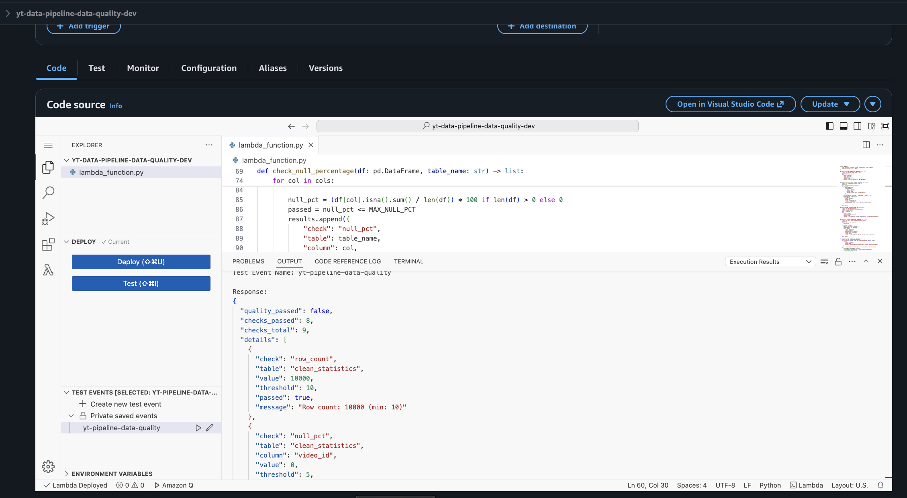

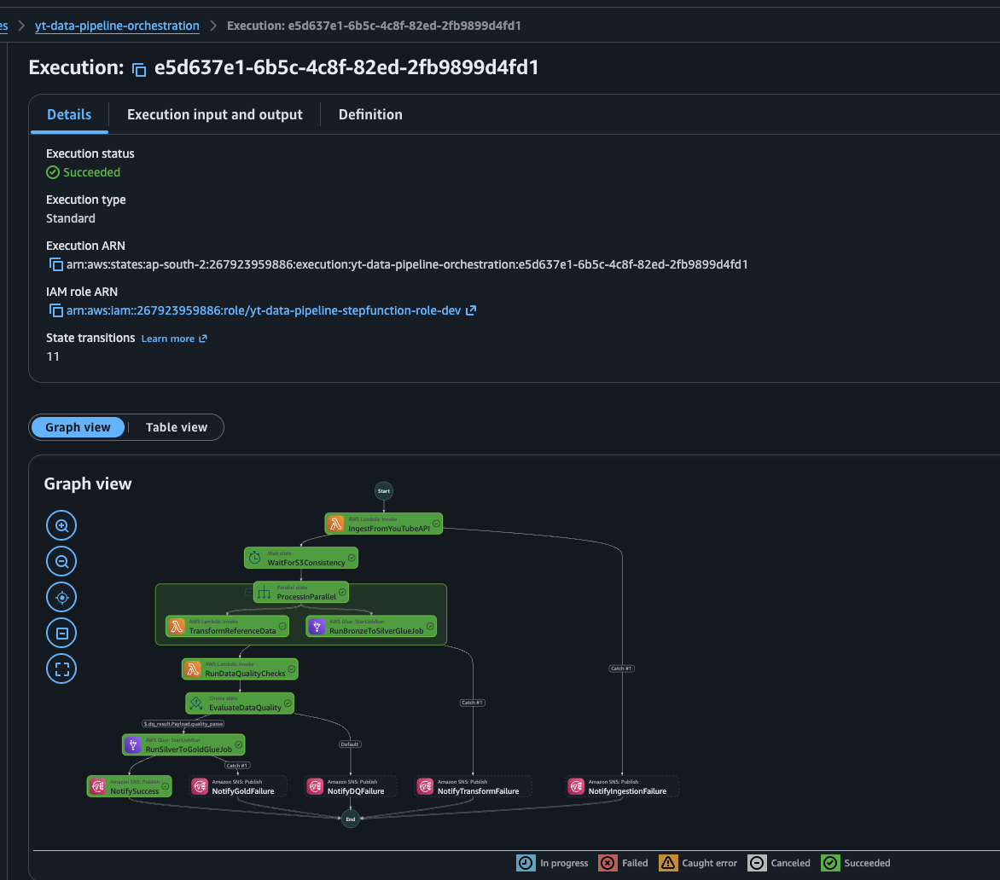

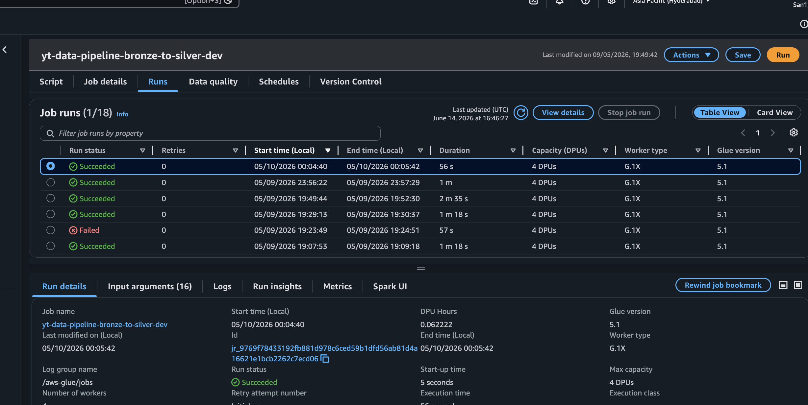

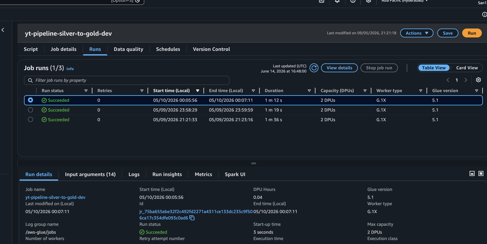

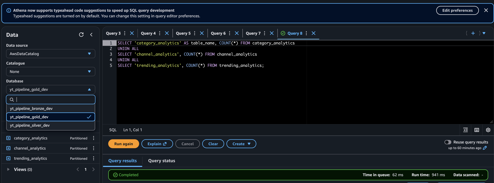

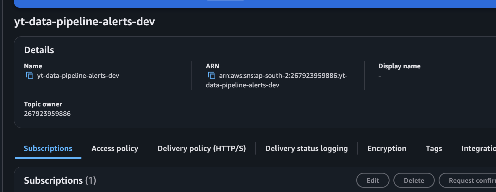

Value Range Validation

Checks:

* Negative views
* Unrealistic view counts

⸻

Freshness Validation

Ensures data was processed recently.

Screenshot


⸻

Workflow Orchestration

AWS Step Functions orchestrates the entire pipeline.

Workflow:

1. Ingest YouTube Data
2. Wait for S3 consistency
3. Run Bronze → Silver transformations
4. Transform reference data
5. Execute Data Quality checks
6. Evaluate quality results
7. Run Silver → Gold aggregation
8. Send SNS notifications

Screenshot


⸻

AWS Glue Jobs

Bronze → Silver

Responsibilities:

* Flatten YouTube API JSON
* Schema standardization
* Deduplication
* Data cleansing
* Metadata generation

Screenshot


⸻

Silver → Gold

Responsibilities:

* Analytics aggregations
* Category analytics
* Channel analytics
* Trending analytics

Screenshot


⸻

Athena Analytics

Example Query:

SELECT
    region,
    SUM(total_views) AS views
FROM yt_pipeline_gold_dev.trending_analytics
GROUP BY region
ORDER BY views DESC;

Screenshot


⸻

Monitoring & Alerting

Monitoring is implemented using:

* CloudWatch Logs
* Step Functions Execution History
* SNS Notifications

Failure scenarios:

* API failures
* Glue failures
* Data quality failures
* Gold aggregation failures

Screenshot


⸻

Performance Optimizations

Implemented optimizations:

* Parquet storage format
* Snappy compression
* Broadcast joins
* Partition pruning
* Predicate pushdown
* Glue Catalog integration
* Window-based deduplication

⸻

Key Engineering Concepts Demonstrated

* Data Lake Architecture
* Medallion Architecture
* ETL / ELT
* Data Quality Frameworks
* Workflow Orchestration
* Distributed Processing with PySpark
* AWS Serverless Data Engineering
* Data Modeling
* Analytics Engineering
* Monitoring and Alerting

⸻

Future Improvements

* Terraform deployment automation
* CI/CD pipeline using GitHub Actions
* Incremental CDC processing
* Iceberg tables
* Great Expectations integration
* Slack notifications
* QuickSight dashboards

⸻

Results

The pipeline successfully:

* Automates ingestion from YouTube APIs
* Eliminates manual data downloads
* Produces analytics-ready datasets
* Enforces data quality standards
* Provides operational monitoring
* Supports scalable reporting and analytics

⸻